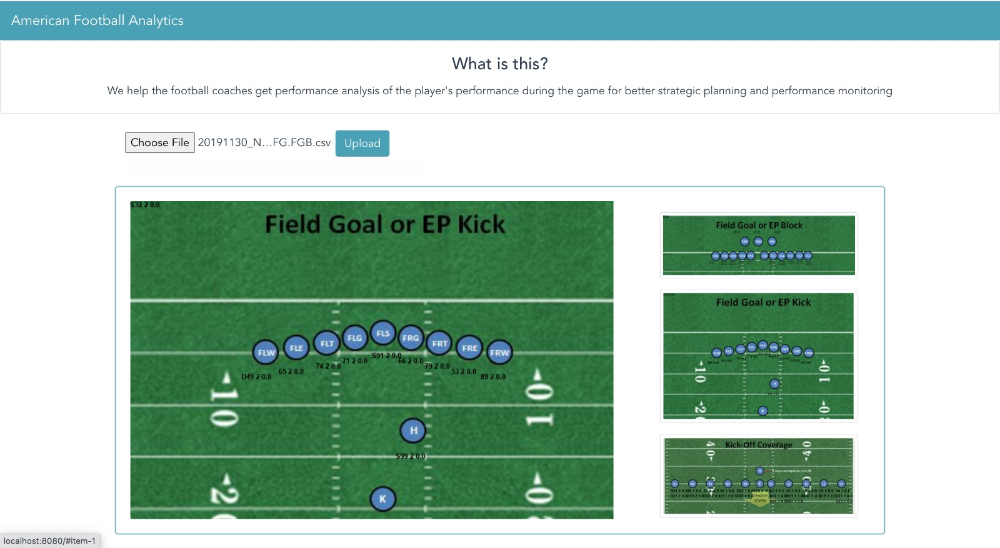
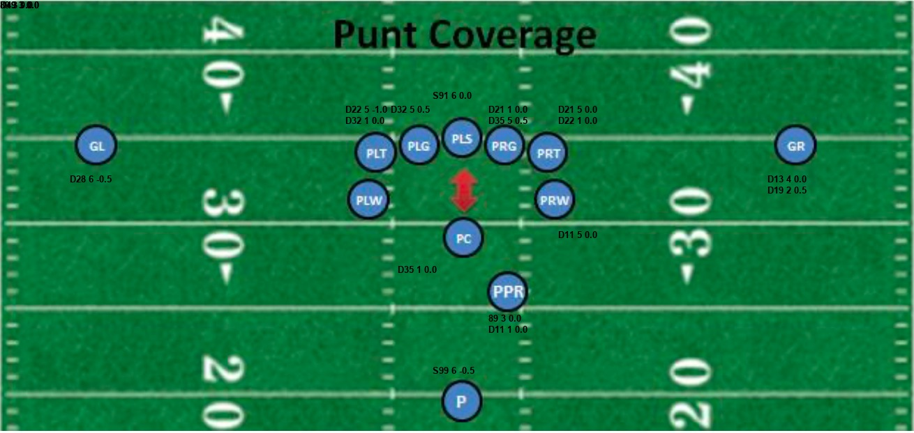

[](https://zenodo.org/badge/latestdoi/293692566)
[](https://opensource.org/licenses/MIT)
[](https://travis-ci.org/himol7/American-Football-Analytics-Application)
[](https://github.com/himol7/American-Football-Analytics-Application/issues)
[](http://hits.dwyl.com/himol7/https://githubcom/himol7/American-Football-Analytics-Application)

# TouchDown, an Analytics application for American Football

[](https://www.youtube.com/watch?v=GLtjMf34_LE&feature=youtu.be&ab_channel=AmitMandliya)

### Project Idea:

Create a web application which can:
* Analyze the football match data
* Show the summary visuals of the analysis

### Why TouchDown?
In 2002, Oakland Atheltics, a seemingly medium-strength team achieved unusual success in their season even after departure of key players. Behind their success was sabermetrics, a field which thrives on quantitative analysis of sports data. Drawing motivation from this success story and understanding the problems which the current football coaches at NC State are facing, we have developed TouchDown - a customer-centric easy-to-use application which provides you a pictorial analysis of position specific player performances.

With a simple UI, all you need to do it just upload the data file<sup>1</sup> and the application promptly outputs the images where you can view your analysis. Furthermore, with some exciting features lined up, we'd be happy to incorporate some new features on demand.

Here is a sample of outputs generated by uploading one of the games data file in out application.


Here as you can see, Player **S99** was present **2** times on position **H** and his overall score is **0.0**


Here as you can see, Player **D28** was present **6** times on position **GL** and his overall score is **-0.5**

As a part of **Project 1**, we have created a functioning application which performs data analytics on games data and outputs 6 individual images for each type of play. Each of these images have summarized data of respective plays imposed on them.

### Tasks to be completed as a part of Project 2:

1. Add functionality to get output of multiple files at once.
2. After 1 is finished, add functionality to get output filtered based on SEASON / MATCH WEEK / MONTH / MATCH and OPPONENT
3. Add Drag-and-Drop functionality in the Front End.
4. Deploy the application on one of the publically available Cloud Services


### Instructions to run:
1. Install the dependency.
```
pip install -r requirements.txt
```
2. Please go to vue-app directory for running the front end.

3. Please go to backend/src directory for running the back end.

<sup>1</sup> Data file refers to the files which are used by football coaches at NC State. The original source of the files is not known to us but it is believed that the source is widely popular amongst football coaches.
